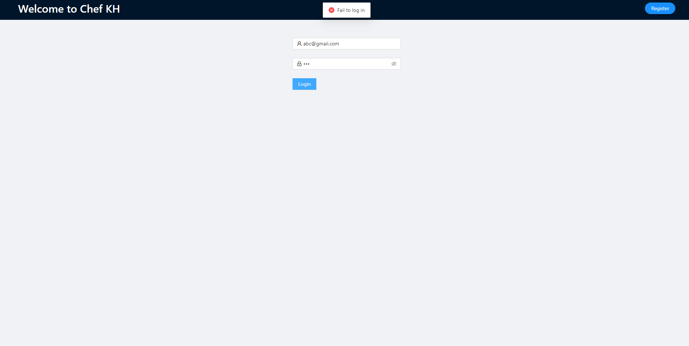

# onlineOrder_frontend
This repo contains frontend code for the onlineOrder project.

### Web Functions

#### 1. Register
register

register warning

#### 2. Log in
log in

log in successfully

log in failed

#### 3. Menu
select restaurant and browse menu

#### 4. Order
add dishes to cart

#### 5. Checkout
checkout
